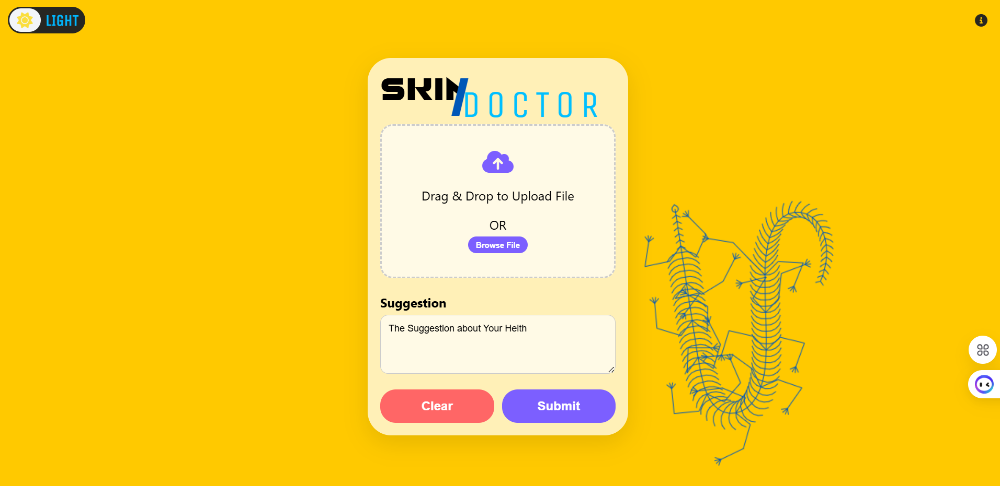

# 🩺 AI Skin Disease Classifier

This is a web-based AI application that predicts skin diseases from uploaded images and provides professional suggestions based on the diagnosis.

## 🚀 Features

- Upload or capture image of a skin condition.
- Real-time AI-based prediction with confidence score.
- Generates medical suggestions via OpenAI API.
- Automatically deletes uploaded images every 20 minutes.
- Fully responsive with light/dark theme toggle.
- Animated canvas-based background (reptile animation).

## 📷 Screenshot

 <!-- Replace with real image if available -->

## 🛠️ Tech Stack

- **Backend:** Flask, Python
- **Frontend:** HTML, CSS, JS (jQuery, Font Awesome)
- **AI:** TensorFlow/Keras for prediction, OpenAI GPT for suggestion
- **Scheduler:** APScheduler for auto-delete feature

## 🧪 Run Locally

1. **Clone the repo**  
```bash
git clone https://github.com/your-username/skin-disease-classifier.git
cd skin-disease-classifier
